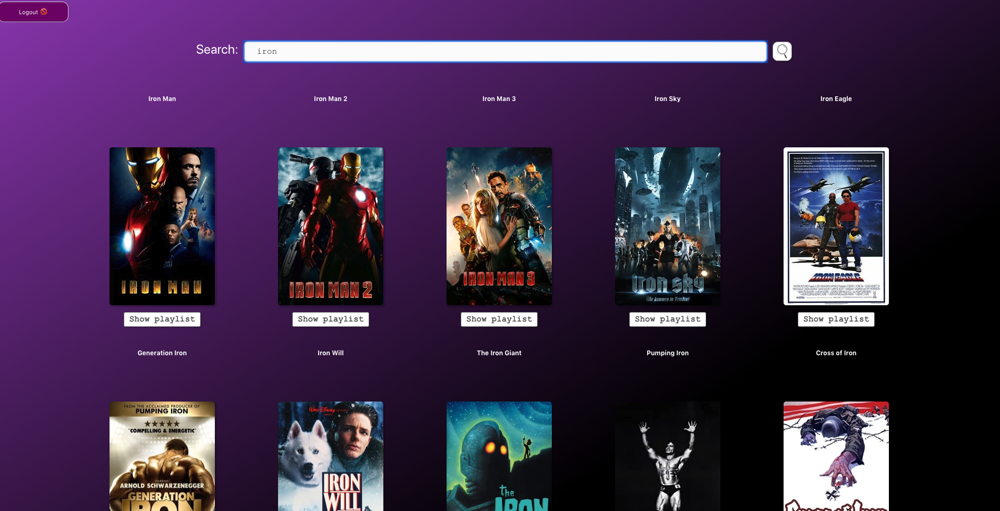

<!-- PROJECT LOGO -->
<br />
<p align="center">
  <a href="https://github.com/othneildrew/Best-README-Template">
    
  </a>

  <h3 align="center">MoviePlaylist Generator</h3>

  <p align="center">
    A great app to bundle the soundtracks of your favorite movies in a playlist.
    <br />
    <a href="https://github.com/raphael39/soloProject-MoviePlaylist/blob/master/Readme.md"><strong>Explore the docs »</strong></a>
    <br />
    <br />
    <a href="https://github.com/raphael39/soloProject-MoviePlaylist/blob/master/Readme.md">View Demo</a>
    ·
    <a href="https://github.com/raphael39/soloProject-MoviePlaylist/issues">Report Bug</a>
    ·
    <a href="https://github.com/raphael39/soloProject-MoviePlaylist/issues">Request Feature</a>
  </p>
</p>


<!-- TABLE OF CONTENTS -->
## Table of Contents

* [About the Project](#about-the-project)
  * [Built With](#built-with)
* [Getting Started](#getting-started)
  * [Prerequisites](#prerequisites)
  * [Installation](#installation)
* [Usage](#usage)
* [Roadmap](#roadmap)
* [Contributing](#contributing)
* [License](#license)
* [Contact](#contact)
* [Acknowledgements](#acknowledgements)


<!-- ABOUT THE PROJECT -->
## About The Project

<!-- [![Product Name Screen Shot][product-screenshot]](https://example.com) -->

Have you ever worried if you could find the soundtracks of the movie that you were lost in time while watching it? Don't worry we've got you! Your favorite playlist of all time is just a few clicks away from you. 

Here's why:
* We are in a time that movie production is way more beyond our playlist and this app allows you to explore all the different soundtrack that you could ever wonder without too much where to find.
* You shouldn't be looking for one single song after the one another and adding them mannually, which is a big loss of time in the time we are living


### Built With
This section lists all major frameworks that this project is build with.
* [react](https://reactjs.org/)
* [react-redux](https://redux.js.org/)
* [Material UI](https://material-ui.com/)


<!-- GETTING STARTED -->
## Getting Started

Later

### Prerequisites


* npm
```sh
npm install npm@latest -g
```

### Installation

1. install react 
2. install Material UI)
3. Get a free API Key at [Spotify](https://developer.spotify.com/dashboard/login)
4. Get a free API Key at [MovieDb](https://developers.themoviedb.org/3/getting-started/introduction)
5. Clone the repo
```sh
git clone https://github.com/raphael39/soloProject-MoviePlaylist.git
```
3. Install NPM packages
```sh
npm install
```
4. Enter your API in `config.js`
```JS
const API_KEY_SPOTIFY = 'ENTER YOUR API';
const API_KEY_MOVIEDB = 'ENTER YOUR API';
```


<!-- USAGE EXAMPLES -->
## Usage


Later....


<!-- ROADMAP -->
## Roadmap

See the [open issues](https://github.com/raphael39/soloProject-MoviePlaylist/issues) for a list of proposed features (and known issues).


<!-- CONTRIBUTING -->
## Contributing

Any contributions you make are **greatly appreciated**.

1. Fork the Project
2. Create your Feature Branch (`git checkout -b feature/AmazingFeature`)
3. Commit your Changes (`git commit -m 'Add some AmazingFeature'`)
4. Push to the Branch (`git push origin feature/AmazingFeature`)
5. Open a Pull Request


<!-- LICENSE -->
## License

See `LICENSE` for more information.


<!-- CONTACT -->
## Contact

Spencer Saleban - [@Github](https://github.com/spencersaleban) - spencer@spencersaleban.com <br>
Raphael Sutter - [@Github](https://github.com/raphael39) - raphael.sutter@t-online.de

Project Link: [https://github.com/raphael39/solo](https://github.com/your_username/repo_name)


<!-- ACKNOWLEDGEMENTS -->
## Acknowledgements
* [Codeworks](https://github.com/codeworks)
* [Pier Andrea Delise](https://github.com/pierandread)


